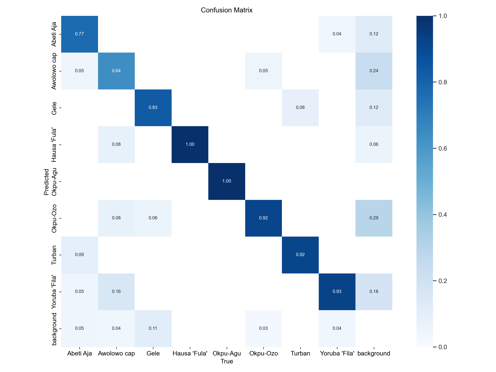
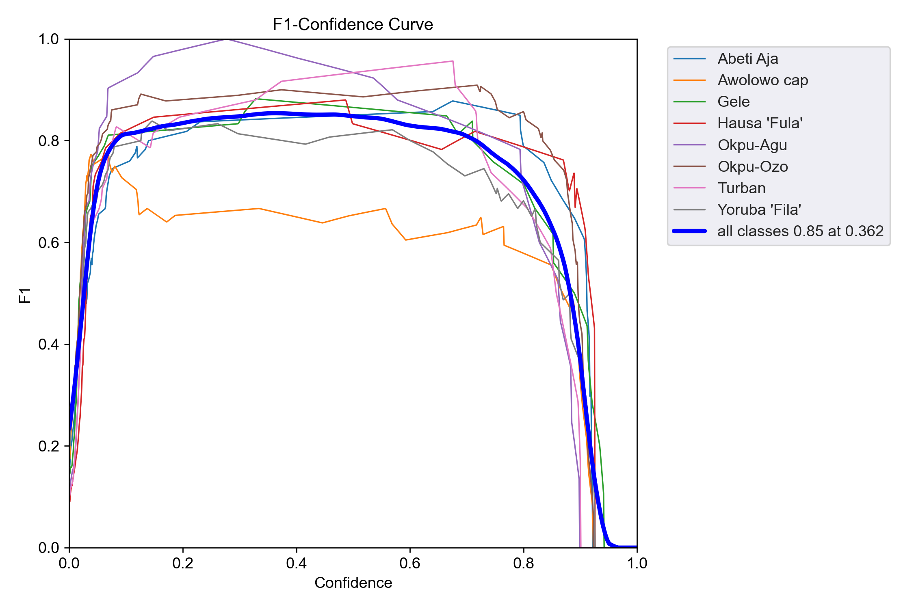

# Nigerian Native Headwear Detection: Project Overview
___

The purpose of this project was to use Object Detection (Computer Vision) detect some of the most popular traditional headgears worn in Nigeria namely; 
* Abeti Aja from the South West, 
* Awolowo from the South West, 
* Fila from the South West, 
* Gele from the South West; 
* Fula from the North; 
* Okpu-Ozo from the South-East
* Okpu-Agu from the South-East 
* the Turban

___
* Used **[Google Web Scraper](https://github.com/ohyicong/Google-Image-Scraper)** to collect the data/images

* Performed data-label annonatation using **[Label Studio](https://github.com/ohyicong/Google-Image-Scraper)**

* Used **[YoloV5](https://github.com/ultralytics/yolov5)** to train **Object Detection** model on the dataset

___
## Model Performamce

#### Confusion Matrix


#### F1_curve


#### PR_curve

___
## How to Detect Images

* Clone repo and install [requirements.txt](https://github.com/EyimofeP/nigerian-headwear/blob/master/requirements.txt) in a
[**Python>=3.7.0**](https://www.python.org/) environment, including
[**PyTorch>=1.7**](https://pytorch.org/get-started/locally/).

  ```bash
  git clone https://github.com/EyimofeP/nigerian-headwear  # clone
  cd yolov5
  pip install -r requirements.txt  # install
  ```

* Add the images or videos you want to detect in the ```detect-img/``` folder 

* Run this command in your terminal
  ```bash
    python detect.py --weights best.pt --source detect-img/img-name.jpg 
                                                detect-img/img-video.mp4
                                                'https://youtu.be/Zgi9g1ksQHc'  # YouTube
                                                0 #Webcam
    ```

* Go to the `runs/detect/` folder to see the results!